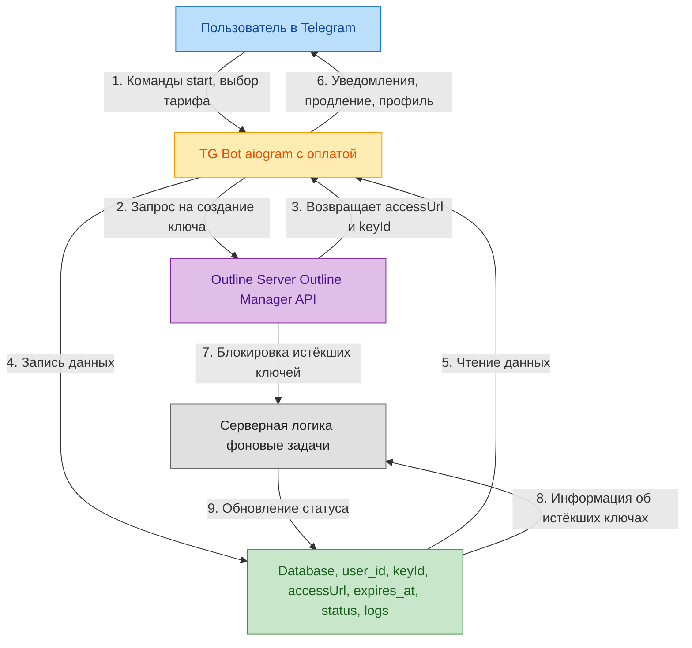
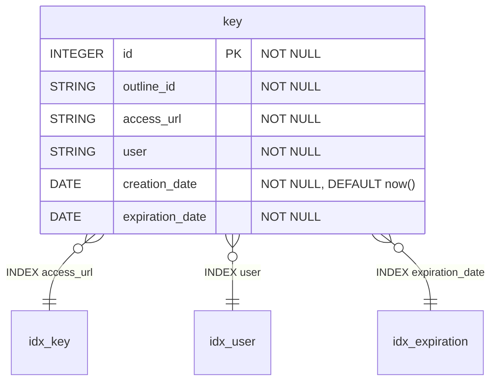

## **Обсуждение структуры проекта (5 часов) - учавствуют все**
    •  Поиск похожих по задумке, уже готовых реализаций данной идеи
    •  Определение функционала бота
    •  Схема взаимодействия бота с Outline
    •  Обсуждение структуры базы данных

## **TG-bot(на aiogram) + Оплата (20 часов) – Даниил**
    •  Настройка окружения
    •  Настройка бота, получение API ключа телеграмм из @BotFather
    •  Реализация /start и меню
    •  Раздел «Тарифы»
    •  Создание платежа (TG payments)
    •  Обработка успешной оплаты
    •  Выдача пользователю VPN-ключа
    •  Раздел «Мой профиль»
    •  Продление подписки
    •  Уведомления об окончании тарифа
    •  Отправка данных на сервер
    •  Логи

## **Работа с Outline и сервером (20 часов) - Физули**
    •  Разработка кода для генерации ключей пользователей
    •  Настройка сервера 
    •  Логи

## **Работа с базой данных (10 часов) - Исмаил**
    •  Запись данных (ключи, связанные с ними пользователи и срок их действия) в БД
    •  Реализация функции валидации ключей
    •  Хранение логов
    •  Логи

## **Связывание функционала бота с сервером и базой данных(5 ~ 10 часов) - участвуют все**
    •  Интеграция бота с Outline API

## **Тестирование (5~7 часов) - Исмаил**
    •  Проверка работоспособности ключей
    •  Проверка работоспособности базы данных
    •  Проверка работоспособности бота
    •  Обнаружение багов и их исправление

## **Сборка через докер (5 ~ 7 часов) - участвуют все**
    •  Сборка конечного продукта

## **Архитектура проекта**

## **Интерфейс бота**

## **Схема БД**

Отзывы на участников:

Физули Рагимов
1) Арендовал VPS, на который разместил outline server для возможности работы с outline_vpn и проекта в целом.

2) Написал первоначальную структуру программы, создал Dockerfile, .env, .gitignore, базовые папки для работы с ботом, бд и outline.

3) Создал класс OutlineCommands в файле outline_api/commands.py для взаимодействия с библиотекой outline_vpn. Этот класс хранит в себе следующие функции:
generate_new_key - функция для генерации ключа для пользователя.
delete_key - функция для удаления выбранного ключа.
get_keys_info - функция для получения информации о количестве ключей, их названий и url.
stop_expired_key - функция для остановки работы истёкших ключей.
start_expired_key - функция для возобновления работы ключа после оплаты.

4) Создал папку tests и файл tests/test_outline.py, в котором прописана логика тестирования функций из outline/commands.py.

5) Добавил logging.

Рагимов Исмаил

1) Изучил все что нужно для работы и взаимодействия с БД в рамках сборки

2) Менял config, Dockerfile, добавил docker-compose.yml

3) Написал методы взаимодействия и получения информации с БД. Написал handlerDB.py и models.py В models.py описана структура базы данных, а в handlerDB.py расписан класс DataBaseHandler, позволяющий добавлять ключи и отслеживать их статус: проверять срок его действия, заблокирован ли он или нет. Также он позволяет создавать базу данных и сбрасывать её.

4) Расписал тесты для проверки методов БД (Файлы conftest.py и test_db_handler.py)

5) Добавил логи
6) Помог связать методы БД с остальными функциями 
7) Тимлид 👍(занимался организационными моментами)

Ефремов Даниил

1.  Разработал Telegram-бота на базе библиотеки aiogram
2.  Реализовал структуру проекта для Telegram-бота, разделив код на логические модули:
handlers — обработка команд и сообщений пользователя,
keyboards —клавиатуры (reply и inline),
services — фоновые задачи и служебная логика,
основной файл main.py для запуска бота и регистрации всех компонентов.
3.  Реализовал пользовательские сценарии работы бота:
отображение главного меню,
просмотр доступных тарифов,
выбор и подтверждение тарифа,
интеграция с Telegram Payments для оплаты подписки,
отображение информации о текущей подписке в разделе «Мой профиль»,
продление существующей подписки.
4.  Выполнил интеграцию Telegram-бота с базой данных
5.  Выполнил интеграцию Telegram-бота с outline-сервером через класс OutlineCommands
6.  Реализовал фоновые асинхронные задачи в папке services
7.  Реализовал модульное тестирование логики Telegram-бота: