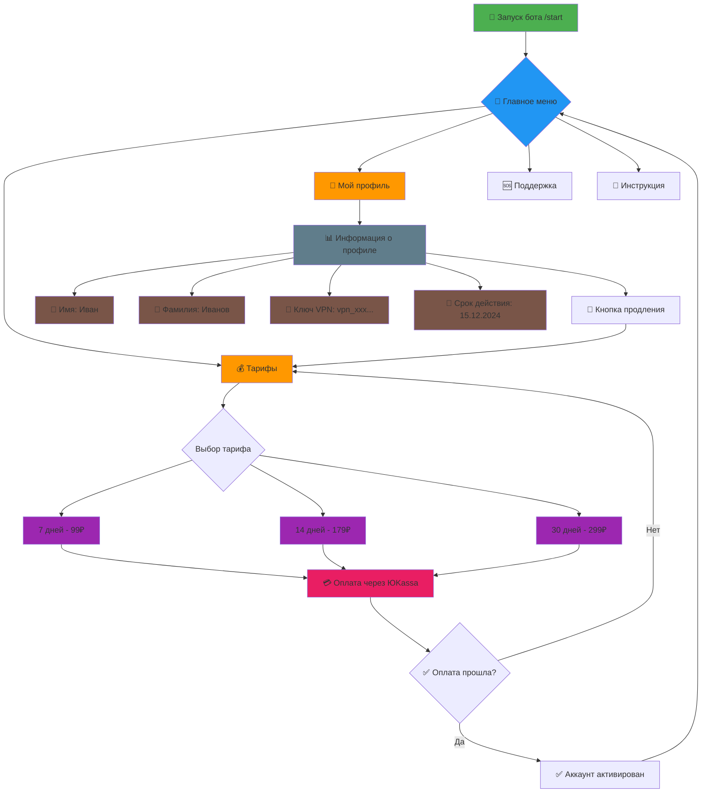
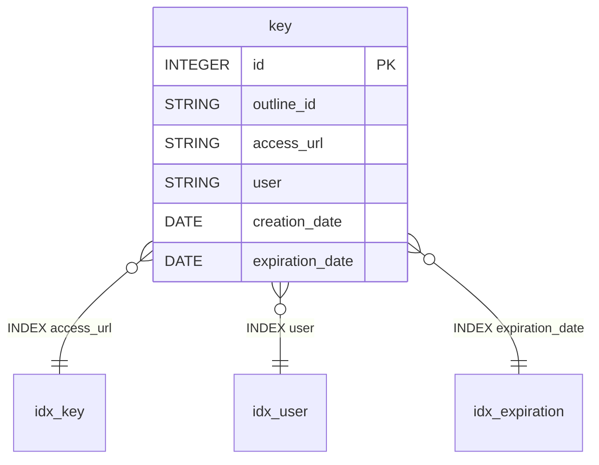

## **Обсуждение структуры проекта (5 часов) - учавствуют все**
    •  Поиск похожих по задумке, уже готовых реализаций данной идеи
    •  Определение функционала бота
    •  Схема взаимодействия бота с Outline
    •  Обсуждение структуры базы данных

## **TG-bot(на aiogram) + Оплата (20 часов) – Даниил**
    •  Настройка окружения
    •  Настройка бота, получение API ключа телеграмм из @BotFather
    •  Реализация /start и меню
    •  Раздел «Тарифы»
    •  Создание платежа (ЮKassa / ТГ-звезды)
    •  Обработка успешной оплаты
    •  Выдача пользователю VPN-ключа (QR + URL)
    •  Раздел «Мой профиль»
    •  Продление подписки
    •  Уведомления об окончании тарифа
    •  Отправка данных на сервер
    •  Логи

## **Работа с Outline и сервером (20 часов) - Физули**
    •  Разработка кода для генерации ключей пользователей
    •  Настройка сервера 
    •  Логи

## **Работа с базой данных (10 часов) - Исмаил**
    •  Запись данных (ключи, связанные с ними пользователи и срок их действия) в БД
    •  Реализация функции валидации ключей
    •  Хранение логов

## **Связывание функционала бота с сервером и базой данных(5 ~ 10 часов) - участвуют все**
    •  Интеграция бота с Outline API

## **Тестирование (5~7 часов) - Исмаил**
    •  Проверка работоспособности сервера
    •  Проверка работоспособности базы данных
    •  Проверка работоспособности бота
    •  Проверка устойчивости к нагрузкам (одновременное пользование сервисом несколькими пользователями)
    •  Обнаружение багов и их исправление

## **Деплой (5 ~ 7 часов) - участвуют все**
    •  Сборка конечного продукта

## **Архитектура проекта**

## **Интерфейс бота**

