## **Обсуждение структуры проекта (5 часов) - учавствуют все**
    •  Поиск похожих по задумке, уже готовых реализаций данной идеи
    •  Определение функционала бота
    •  Схема взаимодействия бота с Outline
    •  Обсуждение структуры базы данных

## **TG-bot(на aiogram) + Оплата (20 часов) – Даниил**
    •  Настройка окружения
    •  Настройка бота, получение API ключа телеграмм из @BotFather
    •  Реализация /start и меню
    •  Раздел «Тарифы»
    •  Создание платежа (ЮKassa / ТГ-звезды)
    •  Обработка успешной оплаты
    •  Выдача пользователю VPN-ключа (QR + URL)
    •  Раздел «Мой профиль»
    •  Продление подписки
    •  Уведомления об окончании тарифа
    •  Отправка данных на сервер
    •  Логи

## **Работа с Outline и сервером (20 часов) - Физули**
    •  Разработка кода для генерации ключей пользователей
    •  Настройка сервера 
    •  Логи

## **Работа с базой данных (10 часов) - Исмаил**
    •  Запись данных (ключи, связанные с ними пользователи и срок их действия) в БД
    •  Реализация функции валидации ключей
    •  Хранение логов

## **Связывание функционала бота с сервером и базой данных(5 ~ 10 часов) - участвуют все**
    •  Интеграция бота с Outline API

## **Тестирование (5~7 часов) - Исмаил**
    •  Проверка работоспособности сервера
    •  Проверка работоспособности базы данных
    •  Проверка работоспособности бота
    •  Проверка устойчивости к нагрузкам (одновременное пользование сервисом несколькими пользователями)
    •  Обнаружение багов и их исправление

## **Деплой (5 ~ 7 часов) - участвуют все**
    •  Сборка конечного продукта

## **Архитектура проекта**

```mermaid
flowchart TD
    A[Пользователь в Telegram] -->|1. Команды start, выбор тарифа| B[TG Bot aiogram с оплатой]
    B -->|2. Запрос на создание ключа| C[Outline Server Outline Manager API]
    C -->|3. Возвращает accessUrl и keyId| B
    B -->|4. Запись данных| D[Database, user_id, keyId, accessUrl, expires_at, status, logs]
    D -->|5. Чтение данных| B
    B -->|6. Уведомления, продление, профиль| A

    C -->|7. Удаление истёкших ключей| E[Серверная логика фоновые задачи]
    D -->|8. Информация об истёкших ключах| E
    E -->|9. Обновление статуса| D

    classDef user fill:#BBDEFB,stroke:#1976D2,color:#0D47A1;
    classDef bot fill:#FFECB3,stroke:#FF9800,color:#E65100;
    classDef outline fill:#E1BEE7,stroke:#7B1FA2,color:#4A148C;
    classDef db fill:#C8E6C9,stroke:#388E3C,color:#1B5E20;
    classDef logic fill:#E0E0E0,stroke:#616161,color:#212121;

    class A user
    class B bot
    class C outline
    class D db
    class E logic
```

## **Интерфейс бота**

```mermaid
graph TD
    A[🚀 Запуск бота /start] --> B{📱 Главное меню}
    
    B --> C[💰 Тарифы]
    B --> D[👤 Мой профиль]
    
    C --> E{Выбор тарифа}
    E --> F[7 дней - 99₽]
    E --> G[14 дней - 179₽]
    E --> H[30 дней - 299₽]
    
    F --> I[💳 Оплата через ЮKassa]
    G --> I
    H --> I
    
    I --> J{✅ Оплата прошла?}
    J -->|Да| K[✅ Аккаунт активирован]
    J -->|Нет| C
    
    D --> L[📊 Информация о профиле]
    L --> M[👤 Имя: Иван]
    L --> N[📧 Фамилия: Иванов]
    L --> O[🔑 Ключ VPN: vpn_xxx...]
    L --> P[📅 Срок действия: 15.12.2024]
    L --> Q[🔄 Кнопка продления]
    
    Q --> C
    
    K --> B
    
    R[🆘 Поддержка] --> B
    S[📖 Инструкция] --> B
    
    
    style A fill:#4CAF50
    style B fill:#2196F3
    style C fill:#FF9800
    style D fill:#FF9800
    style F fill:#9C27B0
    style G fill:#9C27B0
    style H fill:#9C27B0
    style I fill:#E91E63
    style L fill:#607D8B
    style M fill:#795548
    style N fill:#795548
    style O fill:#795548
    style P fill:#795548
```

